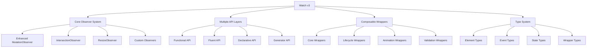

# Watch v3: The Definitive DOM Observation Library

## Philosophy & Design Principles

Watch v3 represents a complete reimagining of DOM observation, combining the battle-tested reliability of mutation observers with modern TypeScript design patterns and developer ergonomics.

### Core Principles

1. **Composability First**: Every feature should be composable with every other feature
2. **Multiple API Styles**: Support functional, fluent, and declarative approaches
3. **Type Safety**: Leverage TypeScript's type system for compile-time correctness
4. **Performance by Default**: Efficient batching and lazy evaluation built-in
5. **Developer Experience**: Intuitive APIs that feel natural to use
6. **Extensibility**: Easy to add new functionality without modifying core

### Design Goals

- **Zero Configuration**: Works out of the box with sensible defaults
- **Incremental Adoption**: Can be used for small interactions or complex applications
- **Framework Agnostic**: Works with any or no framework
- **Memory Efficient**: Automatic cleanup and weak references
- **Debuggable**: Clear error messages and debugging utilities

## Architecture Overview



## Core Types & Interfaces

```typescript
// Core element matching types
type ElementMatcher = string | HTMLElement | ((el: HTMLElement) => boolean);
type ElementScope = HTMLElement | Document;

// Enhanced watch arguments with full type safety
interface WatchArgs<El extends Element = HTMLElement> {
  // Core element info
  el: El;
  type: 'initial' | 'added' | 'removed';
  idx: number;
  arr: ReadonlyArray<El>;
  
  // Mutation context (when available)
  record?: MutationRecord;
  
  // State management
  state: StateManager;
  
  // Event handling
  on: EventManager<El>;
  
  // DOM manipulation
  dom: DOMManager<El>;
  
  // Styling
  style: StyleManager;
  
  // Animation
  animate: AnimationManager;
  
  // Validation
  validate: ValidationManager;
  
  // Lifecycle
  cleanup: CleanupManager;
  
  // Utilities
  utils: UtilityManager;
}

// State management with type safety
interface StateManager {
  get<T = any>(key: string): T | undefined;
  set<T = any>(key: string, value: T): void;
  update<T = any>(key: string, updater: (current: T) => T): void;
  has(key: string): boolean;
  delete(key: string): boolean;
  clear(): void;
  
  // Computed values
  computed<T>(key: string, fn: () => T, deps?: string[]): T;
  
  // Reactive subscriptions
  watch<T>(key: string, callback: (newValue: T, oldValue: T) => void): () => void;
}

// Event handling with sophisticated type safety
interface EventManager<El extends Element> {
  // Standard DOM events
  <K extends keyof HTMLElementEventMap>(
    event: K,
    handler: (this: El, ev: HTMLElementEventMap[K]) => void,
    options?: AddEventListenerOptions
  ): () => void;
  
  // Custom events
  <T = any>(
    event: string,
    handler: (this: El, ev: CustomEvent<T>) => void,
    options?: AddEventListenerOptions
  ): () => void;
  
  // Attribute changes
  attr(
    filter: string | RegExp,
    handler: (mutation: MutationRecord) => void
  ): void;
  
  // Text content changes
  text(handler: (newText: string, oldText: string) => void): void;
  
  // Visibility changes
  visible(handler: (isVisible: boolean, entry: IntersectionObserverEntry) => void): void;
  
  // Resize changes
  resize(handler: (entry: ResizeObserverEntry) => void): void;
  
  // Form events with type safety
  input(handler: (value: string, event: Event) => void): void;
  change(handler: (value: string, event: Event) => void): void;
  
  // Lifecycle events
  mount(handler: () => void): void;
  unmount(handler: () => void): void;
  
  // Event delegation
  delegate<K extends keyof HTMLElementEventMap>(
    selector: string,
    event: K,
    handler: (this: Element, ev: HTMLElementEventMap[K]) => void
  ): () => void;
}

// DOM manipulation with type safety
interface DOMManager<El extends Element> {
  // Query methods
  $<T extends Element = Element>(selector: string): T | null;
  $$<T extends Element = Element>(selector: string): T[];
  
  // Traversal
  parent<T extends Element = Element>(selector?: string): T | null;
  children<T extends Element = Element>(selector?: string): T[];
  siblings<T extends Element = Element>(selector?: string): T[];
  next<T extends Element = Element>(selector?: string): T | null;
  prev<T extends Element = Element>(selector?: string): T | null;
  
  // Content manipulation
  text(): string;
  text(content: string): void;
  html(): string;
  html(content: string): void;
  
  // Attributes
  attr(name: string): string | null;
  attr(name: string, value: string): void;
  attr(attrs: Record<string, string>): void;
  
  // Data attributes
  data(key: string): string | undefined;
  data(key: string, value: string): void;
  data(data: Record<string, string>): void;
  
  // Classes
  addClass(...classes: string[]): void;
  removeClass(...classes: string[]): void;
  toggleClass(className: string, force?: boolean): void;
  hasClass(className: string): boolean;
  
  // Properties
  prop(name: string): any;
  prop(name: string, value: any): void;
  
  // Form specific
  value(): string;
  value(val: string): void;
  checked(): boolean;
  checked(val: boolean): void;
  
  // Visibility
  show(): void;
  hide(): void;
  toggle(force?: boolean): void;
  
  // Insertion
  append(...elements: (Element | string)[]): void;
  prepend(...elements: (Element | string)[]): void;
  before(...elements: (Element | string)[]): void;
  after(...elements: (Element | string)[]): void;
  
  // Removal
  remove(): void;
  empty(): void;
}

// Animation with Web Animations API
interface AnimationManager {
  // Core animation
  animate(keyframes: Keyframe[], options?: KeyframeAnimationOptions): Animation;
  
  // Preset animations
  fadeIn(duration?: number): Animation;
  fadeOut(duration?: number): Animation;
  slideIn(direction?: 'up' | 'down' | 'left' | 'right', duration?: number): Animation;
  slideOut(direction?: 'up' | 'down' | 'left' | 'right', duration?: number): Animation;
  scale(from: number, to: number, duration?: number): Animation;
  bounce(duration?: number): Animation;
  shake(duration?: number): Animation;
  
  // Transition helpers
  transition(property: string, duration: number, easing?: string): void;
  
  // Animation sequences
  sequence(...animations: (() => Animation)[]): Promise<void>;
  parallel(...animations: (() => Animation)[]): Promise<Animation[]>;
}

// Validation with type safety
interface ValidationManager {
  // Basic validation
  validate(validator: (value: string) => boolean | string): boolean;
  
  // Preset validators
  required(): boolean;
  minLength(min: number): boolean;
  maxLength(max: number): boolean;
  pattern(regex: RegExp): boolean;
  email(): boolean;
  url(): boolean;
  number(): boolean;
  
  // Custom validation
  custom(name: string, validator: (value: string) => boolean | string): boolean;
  
  // Validation groups
  group(...validators: (() => boolean)[]): boolean;
  
  // Error handling
  setError(message: string): void;
  clearError(): void;
  hasError(): boolean;
  getError(): string | null;
}

// Cleanup management
interface CleanupManager {
  // Register cleanup functions
  add(fn: () => void): void;
  
  // Remove specific cleanup
  remove(fn: () => void): void;
  
  // Run all cleanup
  run(): void;
  
  // Auto cleanup on unmount
  onUnmount(fn: () => void): void;
}

// Utility functions
interface UtilityManager {
  // Timing
  debounce<T extends (...args: any[]) => any>(fn: T, delay: number): T;
  throttle<T extends (...args: any[]) => any>(fn: T, delay: number): T;
  delay(ms: number): Promise<void>;
  
  // Execution control
  once<T extends (...args: any[]) => any>(fn: T): T;
  when(condition: () => boolean, then: () => void, otherwise?: () => void): void;
  safely<T>(fn: () => T, fallback?: T): T | undefined;
  
  // Batching
  batch(fn: () => void): void;
  
  // Type checking
  isVisible(): boolean;
  isInViewport(): boolean;
  isInput(): boolean;
  isForm(): boolean;
  
  // Measurements
  rect(): DOMRect;
  offset(): { top: number; left: number };
  position(): { top: number; left: number };
  size(): { width: number; height: number };
}
```

## API Reference

### Core Watch Function

The `watch` function is overloaded to support multiple usage patterns:

```typescript
// 1. Functional API - Traditional callback style
watch(selector: ElementMatcher, callback: (args: WatchArgs) => void, options?: WatchOptions): WatchInstance;

// 2. Fluent API - Chainable methods
watch(selector: ElementMatcher, options?: WatchOptions): FluentAPI;

// 3. Declarative API - Configuration object
watch(config: WatchConfig): WatchInstance;

// 4. Generator API - Composable generators
watch(selector: ElementMatcher, generator: () => Generator<WatchBehavior>, options?: WatchOptions): WatchInstance;
```

### 1. Functional API

```typescript
// Simple event handling
watch('.button', ({ on, dom }) => {
  on('click', () => {
    dom.addClass('clicked');
  });
});

// Complex interactive component
watch('.counter', ({ on, state, dom, animate }) => {
  // Initialize state
  state.set('count', 0);
  
  // Update display
  const updateDisplay = () => {
    const count = state.get('count');
    dom.text(`Count: ${count}`);
  };
  
  // Handle clicks
  on('click', () => {
    state.update('count', c => c + 1);
    updateDisplay();
    animate.bounce();
  });
  
  // Initialize display
  updateDisplay();
});

// Form validation
watch('input[type="email"]', ({ on, validate, dom }) => {
  on('input', () => {
    const isValid = validate.email();
    dom.toggleClass('invalid', !isValid);
  });
});
```

### 2. Fluent API

```typescript
// Method chaining
watch('.modal')
  .on('click', '.close', () => {
    // Close modal
  })
  .style('display', 'none')
  .animate(fadeIn())
  .state('isOpen', false)
  .attr('aria-hidden', 'true');

// Conditional chaining
watch('.form-field')
  .on('input', function() {
    this.validate().email();
  })
  .when(args => args.validate.hasError(), 
    api => api.addClass('error'),
    api => api.removeClass('error')
  );
```

### 3. Declarative API

```typescript
// Configuration-based setup
watch({
  selector: '.todo-item',
  state: {
    completed: false,
    text: ''
  },
  events: {
    'click .toggle': ({ state, dom }) => {
      state.update('completed', c => !c);
      dom.toggleClass('completed', state.get('completed'));
    },
    'click .delete': ({ dom }) => {
      dom.remove();
    }
  },
  lifecycle: {
    mount: ({ dom, state }) => {
      dom.text(state.get('text'));
    }
  }
});
```

### 4. Generator API

```typescript
// Composable behaviors
function* clickCounter() {
  yield* useState('count', 0);
  yield* onEvent('click', ({ state, dom }) => {
    state.update('count', c => c + 1);
    dom.text(`Clicked ${state.get('count')} times`);
  });
}

function* fadeAnimation() {
  yield* onMount(({ animate }) => {
    animate.fadeIn();
  });
}

// Compose behaviors
watch('.interactive-button', function*() {
  yield* clickCounter();
  yield* fadeAnimation();
  yield* validation();
});
```

## Wrapper System

### Core Wrappers

```typescript
// Event handling wrapper
export const withEvents = createWrapper((args: WatchArgs) => ({
  ...args,
  on: createEventManager(args.el, args.cleanup)
}));

// State management wrapper
export const withState = createWrapper((args: WatchArgs) => ({
  ...args,
  state: createStateManager(args.el)
}));

// DOM manipulation wrapper
export const withDOM = createWrapper((args: WatchArgs) => ({
  ...args,
  dom: createDOMManager(args.el)
}));

// Animation wrapper
export const withAnimation = createWrapper((args: WatchArgs) => ({
  ...args,
  animate: createAnimationManager(args.el)
}));

// Validation wrapper
export const withValidation = createWrapper((args: WatchArgs) => ({
  ...args,
  validate: createValidationManager(args.el)
}));
```

### Advanced Wrappers

```typescript
// Form handling wrapper
export const withForm = createWrapper((args: WatchArgs) => ({
  ...args,
  form: {
    serialize(): Record<string, string> {
      const form = args.el.closest('form');
      return form ? new FormData(form) : {};
    },
    validate(): boolean {
      // Validate all form fields
    },
    submit(): void {
      // Submit form with validation
    },
    reset(): void {
      // Reset form to initial state
    }
  }
}));

// Drag and drop wrapper
export const withDragDrop = createWrapper((args: WatchArgs) => ({
  ...args,
  drag: {
    enable(): void {
      args.el.draggable = true;
      // Add drag event listeners
    },
    disable(): void {
      args.el.draggable = false;
      // Remove drag event listeners
    },
    onDrag(handler: (event: DragEvent) => void): void {
      // Handle drag events
    }
  }
}));

// Keyboard navigation wrapper
export const withKeyboard = createWrapper((args: WatchArgs) => ({
  ...args,
  keyboard: {
    onKey(key: string, handler: (event: KeyboardEvent) => void): void {
      args.on('keydown', (event) => {
        if (event.key === key) {
          handler(event);
        }
      });
    },
    onKeys(keys: string[], handler: (event: KeyboardEvent) => void): void {
      args.on('keydown', (event) => {
        if (keys.includes(event.key)) {
          handler(event);
        }
      });
    },
    onCombo(combo: string, handler: (event: KeyboardEvent) => void): void {
      // Handle key combinations like "Ctrl+Enter"
    }
  }
}));
```

### Custom Wrapper Creation

```typescript
// Create custom wrappers
export function createWrapper<TArgs, TEnhanced>(
  enhancer: (args: TArgs) => TEnhanced,
  options?: {
    mount?: (args: TArgs) => void;
    unmount?: (args: TArgs) => void;
    cleanup?: (args: TArgs) => void;
  }
) {
  return function wrapper<TSetup extends (args: TEnhanced) => any>(
    setupFn: TSetup
  ): (args: TArgs) => ReturnType<TSetup> {
    return function wrappedSetup(args: TArgs) {
      const enhanced = enhancer(args);
      
      // Run mount hook
      options?.mount?.(args);
      
      // Register cleanup
      if (options?.cleanup) {
        (args as any).cleanup?.add(() => options.cleanup!(args));
      }
      
      // Register unmount
      if (options?.unmount) {
        (args as any).cleanup?.onUnmount(() => options.unmount!(args));
      }
      
      return setupFn(enhanced);
    };
  };
}

// Example: Create a logging wrapper
export const withLogging = createWrapper((args: WatchArgs) => ({
  ...args,
  log: {
    info: (message: string) => console.log(`[${args.el.tagName}] ${message}`),
    warn: (message: string) => console.warn(`[${args.el.tagName}] ${message}`),
    error: (message: string) => console.error(`[${args.el.tagName}] ${message}`)
  }
}), {
  mount: (args) => console.log('Element mounted:', args.el),
  unmount: (args) => console.log('Element unmounted:', args.el)
});
```

## Generator Utilities

```typescript
// State management generators
export function* useState<T>(key: string, initialValue: T) {
  yield (args: WatchArgs) => {
    if (!args.state.has(key)) {
      args.state.set(key, initialValue);
    }
  };
}

// Event handling generators
export function* onEvent<K extends keyof HTMLElementEventMap>(
  event: K,
  handler: (args: WatchArgs, event: HTMLElementEventMap[K]) => void
) {
  yield (args: WatchArgs) => {
    args.on(event, (e) => handler(args, e));
  };
}

// Lifecycle generators
export function* onMount(handler: (args: WatchArgs) => void) {
  yield (args: WatchArgs) => {
    if (args.type === 'initial' || args.type === 'added') {
      handler(args);
    }
  };
}

export function* onUnmount(handler: (args: WatchArgs) => void) {
  yield (args: WatchArgs) => {
    args.cleanup.onUnmount(() => handler(args));
  };
}

// Animation generators
export function* fadeInOnMount(duration = 300) {
  yield* onMount(({ animate }) => {
    animate.fadeIn(duration);
  });
}

// Validation generators
export function* validation() {
  yield (args: WatchArgs) => {
    if (args.el instanceof HTMLInputElement) {
      args.on('input', () => {
        const isValid = args.validate.required();
        args.dom.toggleClass('invalid', !isValid);
      });
    }
  };
}
```

## Implementation Examples

### Simple Interactive Component

```typescript
// Toggle button with state persistence
watch('.toggle-button', ({ on, state, dom }) => {
  // Initialize state
  state.set('active', dom.hasClass('active'));
  
  // Handle clicks
  on('click', () => {
    const isActive = !state.get('active');
    state.set('active', isActive);
    dom.toggleClass('active', isActive);
    
    // Persist to localStorage
    localStorage.setItem('toggle-state', JSON.stringify(isActive));
  });
  
  // Restore from localStorage
  const saved = localStorage.getItem('toggle-state');
  if (saved) {
    const isActive = JSON.parse(saved);
    state.set('active', isActive);
    dom.toggleClass('active', isActive);
  }
});
```

### Form with Validation

```typescript
// Email signup form
watch('.email-form', ({ on, dom, validate, animate }) => {
  const emailInput = dom.$('input[type="email"]');
  const submitButton = dom.$('button[type="submit"]');
  
  // Real-time validation
  on.delegate('input[type="email"]', 'input', function() {
    const isValid = validate.email();
    dom.toggleClass('invalid', !isValid);
    
    if (isValid) {
      submitButton.removeAttribute('disabled');
    } else {
      submitButton.setAttribute('disabled', 'true');
    }
  });
  
  // Form submission
  on('submit', async (event) => {
    event.preventDefault();
    
    if (!validate.email()) {
      animate.shake();
      return;
    }
    
    try {
      dom.addClass('loading');
      await submitForm(emailInput.value);
      dom.addClass('success');
      animate.fadeOut();
    } catch (error) {
      dom.addClass('error');
      animate.shake();
    } finally {
      dom.removeClass('loading');
    }
  });
});
```

### Advanced Component with Multiple Behaviors

```typescript
// Sortable list with drag & drop
watch('.sortable-list', function*() {
  yield* useState('items', []);
  yield* useState('draggedItem', null);
  
  // Enable drag and drop
  yield ({ on, state, dom }) => {
    // Make items draggable
    dom.$$('.item').forEach(item => {
      item.draggable = true;
    });
    
    // Handle drag start
    on.delegate('.item', 'dragstart', function(event) {
      state.set('draggedItem', this);
      this.classList.add('dragging');
    });
    
    // Handle drag over
    on.delegate('.item', 'dragover', function(event) {
      event.preventDefault();
      const draggedItem = state.get('draggedItem');
      if (draggedItem && draggedItem !== this) {
        const rect = this.getBoundingClientRect();
        const midpoint = rect.top + rect.height / 2;
        
        if (event.clientY < midpoint) {
          this.parentNode.insertBefore(draggedItem, this);
        } else {
          this.parentNode.insertBefore(draggedItem, this.nextSibling);
        }
      }
    });
    
    // Handle drag end
    on.delegate('.item', 'dragend', function() {
      this.classList.remove('dragging');
      state.set('draggedItem', null);
      
      // Update items array
      const newItems = Array.from(dom.$$('.item')).map(item => 
        item.dataset.id
      );
      state.set('items', newItems);
    });
  };
  
  // Handle item creation
  yield* onEvent('click', ({ dom, state }) => {
    const addButton = dom.$('.add-item');
    if (addButton) {
      addButton.addEventListener('click', () => {
        const newItem = document.createElement('div');
        newItem.className = 'item';
        newItem.draggable = true;
        newItem.dataset.id = Date.now().toString();
        newItem.textContent = 'New Item';
        
        dom.append(newItem);
        
        // Update state
        const items = state.get('items');
        state.set('items', [...items, newItem.dataset.id]);
      });
    }
  });
});
```

## Best Practices

### 1. Composability

```typescript
// Create reusable behaviors
const clickCounter = () => function*() {
  yield* useState('count', 0);
  yield* onEvent('click', ({ state, dom }) => {
    state.update('count', c => c + 1);
    dom.text(`Count: ${state.get('count')}`);
  });
};

const fadeAnimation = () => function*() {
  yield* onMount(({ animate }) => animate.fadeIn());
};

// Compose behaviors
watch('.interactive-element', function*() {
  yield* clickCounter();
  yield* fadeAnimation();
});
```

### 2. Performance Optimization

```typescript
// Use batching for multiple updates
watch('.data-grid', ({ on, dom, utils }) => {
  on('data-update', () => {
    utils.batch(() => {
      // Multiple DOM updates are batched
      dom.$$('.cell').forEach(cell => {
        cell.textContent = getData(cell.dataset.id);
      });
    });
  });
});

// Use throttling for frequent events
watch('.search-input', ({ on, utils }) => {
  const throttledSearch = utils.throttle(performSearch, 300);
  
  on('input', throttledSearch);
});
```

### 3. Error Handling

```typescript
// Wrap operations in safety checks
watch('.fragile-component', ({ utils, dom }) => {
  const result = utils.safely(() => {
    // Potentially failing operation
    return complexOperation();
  }, 'fallback-value');
  
  dom.text(result);
});
```

### 4. Testing

```typescript
// Create testable components
export function createCounter(selector: string) {
  return watch(selector, ({ on, state, dom }) => {
    state.set('count', 0);
    
    on('click', () => {
      state.update('count', c => c + 1);
      dom.text(`Count: ${state.get('count')}`);
    });
    
    // Return API for testing
    return {
      getCount: () => state.get('count'),
      increment: () => state.update('count', c => c + 1),
      reset: () => state.set('count', 0)
    };
  });
}

// Test
const counter = createCounter('.test-counter');
counter.increment();
expect(counter.getCount()).toBe(1);
```

## Migration Guide

### From v1/v2 to v3

```typescript
// v1/v2 style
watch('.button', ({ on, state }) => {
  state.count = 0;
  on('click', () => {
    state.count++;
  });
});

// v3 equivalent
watch('.button', ({ on, state }) => {
  state.set('count', 0);
  on('click', () => {
    state.update('count', c => c + 1);
  });
});

// v3 with generators (recommended)
watch('.button', function*() {
  yield* useState('count', 0);
  yield* onEvent('click', ({ state }) => {
    state.update('count', c => c + 1);
  });
});
```

## Extension Points

### Custom Managers

```typescript
// Create custom manager
interface DatabaseManager {
  save(data: any): Promise<void>;
  load(id: string): Promise<any>;
  delete(id: string): Promise<void>;
}

function createDatabaseManager(el: Element): DatabaseManager {
  return {
    async save(data: any) {
      const id = el.dataset.id;
      await fetch(`/api/data/${id}`, {
        method: 'PUT',
        body: JSON.stringify(data)
      });
    },
    async load(id: string) {
      const response = await fetch(`/api/data/${id}`);
      return response.json();
    },
    async delete(id: string) {
      await fetch(`/api/data/${id}`, {
        method: 'DELETE'
      });
    }
  };
}

// Add to watch args
const withDatabase = createWrapper((args: WatchArgs) => ({
  ...args,
  db: createDatabaseManager(args.el)
}));
```

### Custom Observers

```typescript
// Create custom observer
function createScrollObserver(callback: (entry: IntersectionObserverEntry) => void) {
  return new IntersectionObserver(
    (entries) => entries.forEach(callback),
    { threshold: [0, 0.25, 0.5, 0.75, 1] }
  );
}

// Use in wrapper
const withScrollTracking = createWrapper((args: WatchArgs) => ({
  ...args,
  scroll: {
    onScroll(handler: (progress: number) => void) {
      const observer = createScrollObserver((entry) => {
        handler(entry.intersectionRatio);
      });
      observer.observe(args.el);
      args.cleanup.add(() => observer.disconnect());
    }
  }
}));
```

## Conclusion

Watch v3 represents the culmination of years of DOM observation patterns, combining the best aspects of functional programming, type safety, and modern JavaScript features. It's designed to scale from simple interactions to complex applications while maintaining excellent developer experience and performance.

The library's composable architecture means you can start small and grow your usage as needed, always with the confidence that comes from comprehensive type safety and battle-tested patterns.

### Key Takeaways

1. **Use generators for complex behaviors** - They're the most composable and readable
2. **Leverage the wrapper system** - Don't reinvent common patterns
3. **Type safety is your friend** - Let TypeScript catch errors at compile time
4. **Performance is built-in** - Batching and cleanup are handled automatically
5. **Extend thoughtfully** - The architecture supports extension without modification

Watch v3 is more than a library - it's a philosophy for building maintainable, performant, and delightful web interactions.
